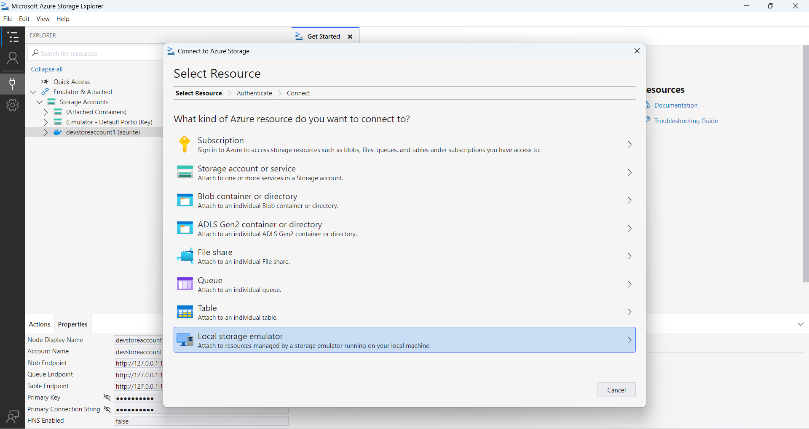
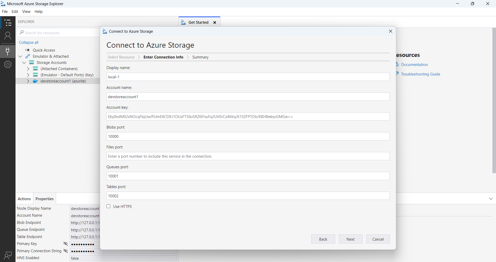
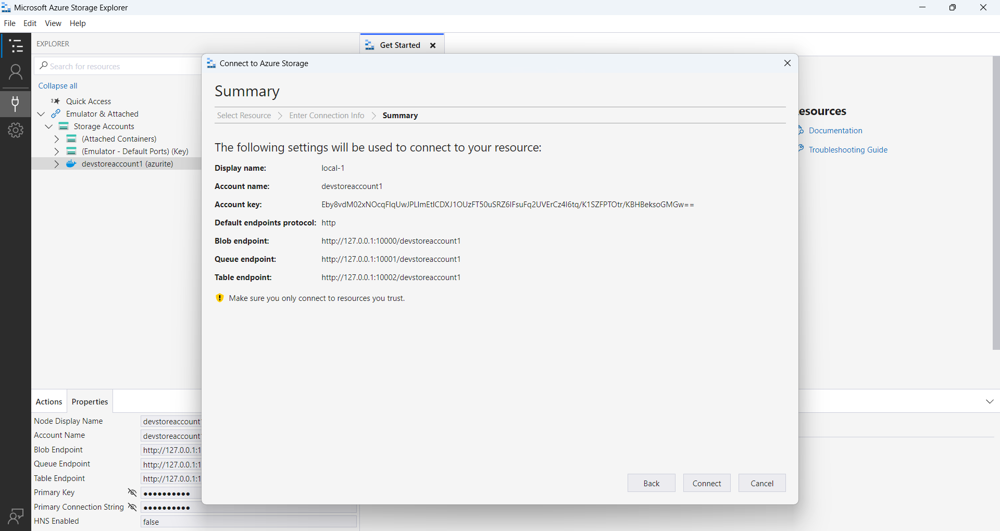

## Descripción de Azurite como Azure Blob Storage 🚀

¡Bienvenido a tu guía para usar Azurite como un emulador de Azure Blob Storage! Azurite es una herramienta de código abierto que simula los servicios de almacenamiento de Azure, permitiéndote desarrollar y probar tus aplicaciones localmente sin necesidad de una conexión a Internet. 🌐

### ¿Qué es Azurite? 🤔

Azurite es un emulador ligero que proporciona un entorno local gratuito para probar aplicaciones basadas en la nube. Soporta los servicios de Blob, Queue y Table Storage, y es compatible con múltiples plataformas como Windows, Linux y macOS. 🖥️

### Instalación de Azurite 🛠️
Puedes instalar Azurite de varias maneras:

1. Usando Docker:

    ```bash
        docker run -p 10000:10000 -p 10001:10001 -p 10002:10002 -v ./data:/data mcr.microsoft.com/azure-storage/azurite
    ```

2. Usando npm:
   
    ```bash
        npm install -g azurite
        azurite --silent --location c:\azurite --debug c:\azurite\debug.log
    ```

3. Visual Studio Code:

    - Instala la extensión de Azurite desde el marketplace de Visual Studio Code.

### Uso de Azurite 🏗️
Para interactuar con Azurite, puedes utilizar herramientas como [Azure Storage Explorer](https://github.com/microsoft/AzureStorageExplorer/releases). Simplemente conecta a tu emulador local y podrás gestionar tus blobs, colas y tablas de manera visual.

#### Pasos para configurar Azure Storage Explorer

##### 1. Abrimos Azure Storage Explorer


##### 2. En la ventana **Select Resource**, seleccionamos la opción Local storage emulator



##### 3. Para establecer una conexión con **Azure Storage**, especificamos los datos como se muestra en la imagen



> [!NOTE]
> Estos datos serán lo que se usan desde el fichero appSettings.json (en el caso de .net) para conectar nuestras apps.

##### 4. Resumen de configuración



##### Configurar CORS

###### 1. Iniciamos una conexión con Azure Storage Explorer y clic derecho en la opción **Blob container** y seleccionamos la opción **Configure CORS settings...**


###### 2. Dentro de la ventana **CORS Settings**, clic en el botón **Add**


###### 3. Desde el formulario **Add CORS Rule**, especificamos los datos que seguidamente se muestran


###### 4. Listo, siguiendo estos pasos debe quedar configurado Azurite + Azure Blob Explorer.

### Conclusión 🎉
Azurite es una herramienta poderosa para desarrolladores que buscan emular Azure Blob Storage localmente. Con su fácil instalación y configuración, puedes comenzar a desarrollar y probar tus aplicaciones sin costo alguno. ¡Disfruta de la experiencia de desarrollo sin complicaciones! 🚀